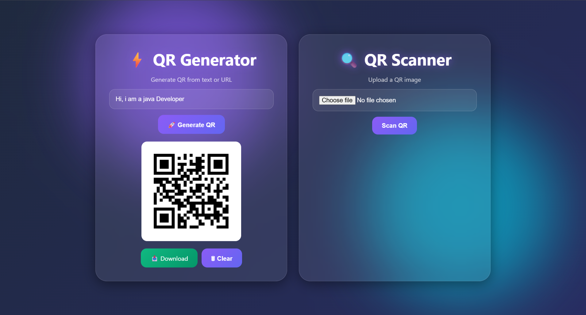
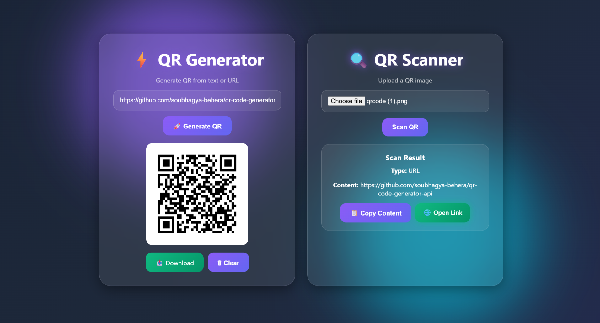

# ⚡ QR Code Generator & Scanner

A modern web application built using **Java, Spring Boot, Thymeleaf, ZXing, HTML, CSS, and JavaScript** that allows users to generate QR codes instantly and scan QR images to extract their content.

---

## 🚀 Features

### QR Generator
- Generate QR Codes from Text or URLs
- Download QR Codes as PNG
- Enter Key Support
- Instant QR Generation

### QR Scanner
- Upload and Scan QR Images
- Automatic Content Detection
  - URL
  - Email
  - Phone Number
  - Text
- Copy Scanned Content
- Open Scanned URLs Directly

### UI / UX
- Premium Glassmorphism Design
- Animated Background Effects
- Toast Notifications
- Responsive Mobile Layout
- Smooth Hover Animations
- Modern Gradient UI

---

## 🛠️ Tech Stack

### Backend
- Java 17
- Spring Boot
- ZXing

### Frontend
- HTML5
- CSS3
- JavaScript
- Thymeleaf

### Build Tool
- Maven

---

## 📸 Screenshots

### QR Generator


### QR Scanner


### Mobile View


---

## 📂 Project Structure

```text
QR-Code-Generator-Scanner
│
├── src
│   ├── main
│   │   ├── java
│   │   ├── resources
│   │   │   ├── static
│   │   │   │   ├── css
│   │   │   │   └── js
│   │   │   └── templates
│
├── pom.xml
├── mvnw
├── mvnw.cmd
└── README.md
```

---

## ⚙️ Installation

Clone the repository:

```bash
git clone https://github.com/soubhagya-behera/QR-Code-Generator-Scanner.git
```

Move into project directory:

```bash
cd QR-Code-Generator-Scanner
```

Run the application:

```bash
mvn spring-boot:run
```

Open in browser:

```text
http://localhost:8080
```

---


## 🔮 Future Enhancements

- QR Color Customization
- Logo Embedded QR Codes
- QR History
- Drag & Drop Scanner
- Bulk QR Generation

---

## 👨‍💻 Author

**Soubhagya Kumar Behera**

Java Full Stack Developer

* GitHub: https://github.com/soubhagya-behera

* LinkedIn: https://www.linkedin.com/in/soubhagyakumar-java

* Portfolio: https://soubhagya-portfolio-olive.vercel.app

---

⭐ If you like this project, consider giving it a star.